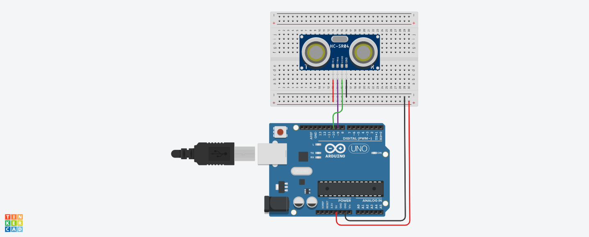

# Arduino Ultrasonic Radar & Motor Control Demo

> HC-SR04 radar · Live browser display via Web Serial API · 3-tier audio alerts · L298N DC motor control demo  
> **La Cité collégiale — Arduino / STEM Outreach · 2025–2026**

---

## Demonstration Video

> 📹 *Video coming soon — demonstration of hand approaching the HC-SR04 sensor and radar reacting in real time with zone-based audio alerts.*

<!-- Replace the line below with your actual video embed or link once uploaded -->
<!-- [](https://www.youtube.com/watch?v=YOUR_VIDEO_ID) -->

---

## Wiring Diagram



---

## Overview

Two Arduino projects built for educational and STEM outreach purposes.

**Project 1 — HC-SR04 Ultrasonic Radar**  
I built a real-time radar system where an Arduino Uno sweeps an HC-SR04 ultrasonic sensor via a servo motor, streams live distance + angle data over Serial, and a custom browser interface renders the radar sweep on an HTML5 Canvas — with automatic audio alerts based on detection zones. No external libraries or frameworks — pure HTML/CSS/JavaScript.

**Project 2 — L298N DC Motor Control Demo**  
I designed and documented a multi-mode motor control sketch demonstrating step response, pulse mode, smooth bidirectional ramping, and direction reversal using PWM on the L298N driver.

---

## Project 1 — HC-SR04 Ultrasonic Radar

### Hardware

| Component | Part | Pin Connection |
|-----------|------|----------------|
| Microcontroller | Arduino Uno R3 | — |
| Ultrasonic sensor | HC-SR04 | TRIG → D9 · ECHO → D10 |
| Servo motor | Standard servo | Signal → D3 |
| Power | USB / 5 V | VCC · GND |

### Detection Zones

| Zone | Distance Range | Display Color | Audio Alert |
|------|---------------|---------------|-------------|
| 🟢 LIBRE | 26 – 40 cm | Green | Silent |
| 🟡 ATTENTION | 11 – 25 cm | Yellow | `attention.mp3` — repeating beep |
| 🔴 DANGER | 0 – 10 cm | Red | `danger.mp3` — continuous siren |

> Zones are defined directly in `final.ino` as constants — easy to adjust for different applications:
> ```cpp
> const int ZONE_DANGER_MAX    = 10;   // cm
> const int ZONE_ATTENTION_MAX = 25;   // cm
> const int ZONE_LIBRE_MAX     = 40;   // cm
> ```

### How It Works

```
[Arduino Uno]
  ├── Servo sweeps 0° → 180° → 0° continuously (2° steps, 30 ms delay)
  ├── At each angle: HC-SR04 fires 10 µs TRIG pulse → times ECHO pulse
  ├── Distance formula: dist = (duration × 0.0343) / 2  [cm]
  ├── Out-of-range (> 400 cm or no echo): returns 400 as sentinel value
  └── Sends "ANGLE,DISTANCE,ZONE\n" over Serial at 9600 baud

[Browser — Web Serial API]
  ├── Connects directly to Arduino COM port (Chrome/Edge 89+)
  ├── Parses incoming "angle,distance,zone" lines in real time
  ├── Plots detection points at correct polar coordinates on Canvas
  ├── Animates the sweep line and fades old detection dots over ~180 frames
  └── Triggers zone-based audio alerts via Web Audio API or MP3 files
```

### Serial Output Format

```
Format:   "ANGLE,DISTANCE,ZONE\n"
Example:  "45,87,0\n"   →  45°, 87 cm, Zone 0 (LIBRE)
Example:  "90,8,2\n"    →  90°, 8 cm,  Zone 2 (DANGER)
Baud:     9600
```

The sketch also supports a **fixed-angle mode** (no servo) — set `use_servo = false` in `final.ino` for stationary distance sensing.

### Live Radar Interface (`radar_live.html`)

A single self-contained HTML file — open in Chrome or Edge, click **CONNECT**, select the Arduino port.

**Interface features:**
- Military-style green-on-black radar display with animated sweep line and fading detection trails
- Real-time polar coordinate plotting — detection dots color-coded by zone (green / yellow / red)
- Glow pulse effect on fresh detections; dots fade over ~180 animation frames
- Zone overlay rings drawn directly on canvas (red core 0–10 cm, yellow 11–25 cm, green 26–40 cm)
- Live side panel: large distance readout, animated angle needle (SVG), active zone indicator, serial log
- Web Serial connect/disconnect button with animated status pill (connected / disconnected / error)
- Baud rate selector (9600 / 57600 / 115200)
- Packet counter and FPS counter in the bottom bar
- CRT scanline overlay for visual fidelity
- Responsive layout — side panel hides on mobile

**Audio system:**
- Configured via `USE_MP3 = true/false` flag at the top of the script
- **MP3 mode:** plays `danger.mp3` (loop) and `attention.mp3` (loop) from the local folder
- **Synthesis fallback:** Web Audio API generates a synthetic siren (FM-modulated sawtooth, 700 Hz base ±280 Hz LFO) and repeating sine beep — no files needed
- Zone transitions trigger `stopAllSounds()` before starting the new alert — no overlapping audio

**Interface tech stack:**
- HTML5 Canvas (radar rendering)
- Web Serial API (browser ↔ Arduino, no drivers)
- Web Audio API (synthesized alerts + MP3 playback)
- Orbitron + Share Tech Mono (Google Fonts — HUD aesthetic)
- Zero dependencies — pure HTML/CSS/JS, no frameworks or build tools

### How to Run

1. Upload `final/final.ino` to the Arduino Uno (Arduino IDE or CLI)
2. Connect the HC-SR04 and servo as shown in the wiring diagram
3. Connect Arduino via USB
4. Open `final/radar_live.html` in **Chrome or Edge** (v89+)
5. Select the correct baud rate (9600) in the dropdown
6. Click **⬡ CONNECTER ARDUINO** → select the Arduino COM port
7. The radar display starts immediately

> **Browser requirement:** Web Serial API requires Chrome 89+ or Edge 89+. Firefox is not supported.  
> **Audio:** Place `attention.mp3` and `danger.mp3` in the same folder as `radar_live.html` for sound alerts. If MP3 files are absent, the synthesized fallback activates automatically.

---

## Project 2 — L298N DC Motor Control Demo

### Hardware

| Component | Part | Pin Connection |
|-----------|------|----------------|
| Microcontroller | Arduino Uno R3 | — |
| Motor driver | L298N | ENA → D9 (PWM) · IN1 → D7 · IN2 → D8 |
| DC Motor | Any 5–12 V DC motor | Motor A output on L298N |

### Core Functions

```cpp
motorForward(int spd)     // IN1=HIGH, IN2=LOW, ENA=spd
motorReverse(int spd)     // IN1=LOW,  IN2=HIGH, ENA=spd
motorStop()               // IN1=LOW,  IN2=LOW,  ENA=0
smoothRamp(bool fwd, int from, int to, int stepDelay)   // linear PWM ramp
```

### Demo Modes (auto-cycling loop)

| Mode | Description |
|------|-------------|
| **Step Response** | Steps through 0% → 25% → 50% → 75% → 100% PWM, 1.5 s per step |
| **Pulse** | 5× rapid on/off bursts at full speed (300 ms on / 300 ms off) |
| **Oscillate** | Smooth ramp forward 0→255→0, then reverse 0→255→0 — repeated 3× |
| **Reverse** | Ramp to 200 forward → stop → ramp to 200 reverse → stop |

All mode transitions are printed to **Serial Monitor** (9600 baud) for live visibility during demos.

---

## Files in This Repository

| File | Description |
|------|-------------|
| `final/final.ino` | Arduino sketch — servo sweep + HC-SR04 measurement + Serial output |
| `final/radar_live.html` | Browser radar UI — Web Serial, Canvas radar, Web Audio alerts |
| `final/attention.mp3` | Alert audio — object at 11–25 cm (ATTENTION zone) |
| `final/danger.mp3` | Alert audio — object at 0–10 cm (DANGER zone) |
| `final/dangerS.mp3` | Alert audio — critical variant |
| `final/Radar_Arduino_Simple.png` | Tinkercad wiring diagram |
| `final/radar_live.html.bak` | Backup of radar interface |
| `motor_control_enhanced.ino` | L298N DC motor demo — step, pulse, oscillate, reverse modes |
| `final.rar` | Full project archive |

---

## What I Built

- **Designed** the detection zone thresholds and serial output protocol for browser compatibility
- **Wired** the HC-SR04 sensor, servo motor, and Arduino Uno on a breadboard
- **Wrote** the Arduino firmware (`final.ino`) — servo sweep loop, HC-SR04 timing, zone classification, and serial output
- **Built** the full browser radar interface from scratch — Canvas rendering, Web Serial parsing, SVG angle needle, and audio system
- **Implemented** two audio modes (MP3 playback and Web Audio API synthesis) with clean zone-transition logic
- **Tested** the radar live — verified zone triggering, audio transitions, and detection accuracy across the 0–40 cm range
- **Demonstrated** the system during STEM outreach workshops at La Cité (bilingual delivery, EN/FR)
- **Documented** both projects with wiring diagrams, serial protocol specs, and demo mode descriptions

---

## Skills Demonstrated

`HC-SR04 ultrasonic sensor` `Servo motor control` `Arduino Serial communication (UART)` `Web Serial API` `HTML5 Canvas` `JavaScript` `Web Audio API` `PWM motor control` `L298N H-bridge driver` `Bidirectional DC motor` `Embedded C/C++` `STEM outreach` `Technical documentation`

---

## Course & Context

**Arduino / STEM Outreach**  
La Cité collégiale, Ottawa · 2025–2026  
Also used as demonstration hardware during **Arduino STEM Workshops** for visiting high school students (Nov 2025 – Feb 2026).

---

*Adam Zaghloul · La Cité collégiale · 2025–2026 · [adamzaghloul07@gmail.com](mailto:adamzaghloul07@gmail.com)*
